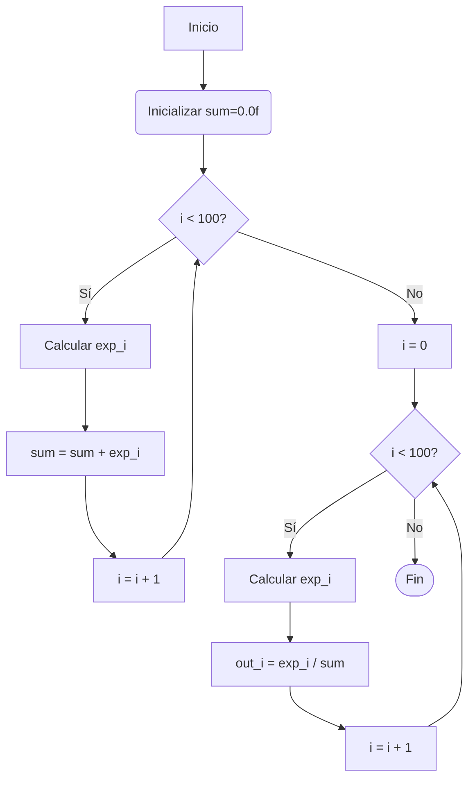

Hi! I'm José María Jiménez-Coronado, but you can call me Chema.
I'm an Electronics Engineer graduated from the Costa Rica Institute of Technology and devoted to space and plasma science.

Currently I'm working as a the Electronics Engineer Leader for the R&D department of an RF communications company based in the US, where I'm in
charge of tasks regarding FPGA, embedded systems, radiofrequency, DSP, electronic design, product design, product compliace and SDR.

You can contact me via email at josemarijc2010@hotmail.com 

this is test, only a test
